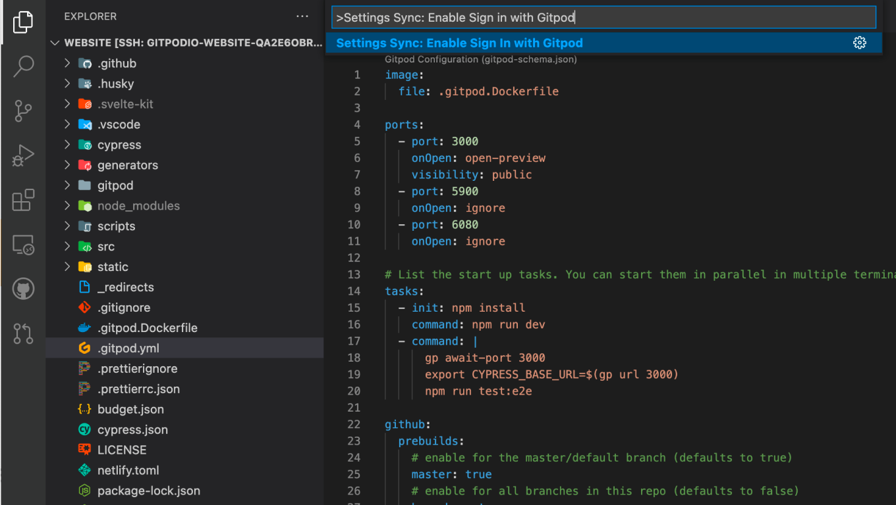

Tl;dr: from now, you can use Settings Sync with Gitpod in VS Code Desktop. You can read [the docs](https://www.gitpod.io/docs/ides-and-editors/settings-sync#enabling-settings-sync-in-vs-code-desktop) for more info.

Visual Studio Code enables you to synchronize your settings, themes, extensions and other preferences across machines via a feature called [Settings Sync](https://code.visualstudio.com/docs/editor/settings-sync). This feature is convenient for both having all your machines' preferences in sync, but also for quickly bootstrapping your editor on any new machine, just the way you like it.

Implementing Settings Sync was achieved by Gitpod making an open-source version of the Settings Sync backend, because the setting sync server that Microsoft provides with their Settings Sync service is private and therefore inaccessible to 3rd party services.

It's nice having Settings Sync work with VS Code in the browser, but how are you supposed to bring the settings you have on your local machine to Gitpod? Should you copy your whole JSON file with your settings and manually install every extension that you have locally?

These are questions, which we have asked ourselves at Gitpod as well - and we found a solution! You can now, with the help of the Gitpod VS Code extension (which you might already have if you've used Gitpod with VS Code Desktop) have your settings synced to Gitpod instead of Microsoft, making it the place of your preferences across machines. Having the ability to enable settings sync locally with VS Code Desktop enables you to get around some browser limitations, like Ctrl+W [[1](https://github.com/gitpod-io/openvscode-server/discussions/322)] and others.

<iframe title="Gitpod Local Settings Sync guide" src="https://www.loom.com/embed/9a4b3cb32d134aa69f7eb1b39340ccf6" frameborder="0" webkitallowfullscreen mozallowfullscreen allowfullscreen style="position: absolute; top: 0; left: 0; width: 100%; height: 100%;"></iframe>

The process for setting local Settings Sync up inside VS Code Desktop is as follows:

- Install the [Gitpod extension](https://marketplace.visualstudio.com/items?itemName=gitpod.gitpod-desktop)
- Open the Command Palette (F1 or Cmd/Ctrl + Shift + P) and run Settings Sync: Enable Sign In with Gitpod,
- Restart your VS Code Desktop application.
- Enable settings sync from the Manage gear menu at the bottom of the Activity Bar.
- Resolve any settings conflicts - there will most likely be differences between your remote VS Code config and your local one. This step makes sure you retain the preferences you want.
- Voilà! Now you should see your preferences be reflected on VS Code Browser inside of Gitpod as well.

We'd love for you to try out the new local Settings Sync for yourself, and would love to hear from you in our [community](https://www.gitpod.io/community). We look forward to hearing from you!
